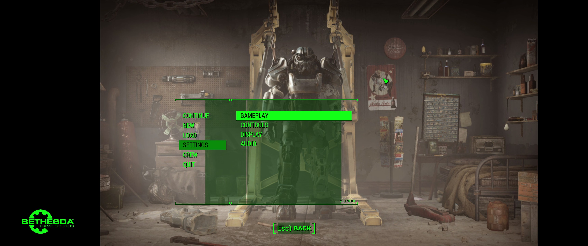
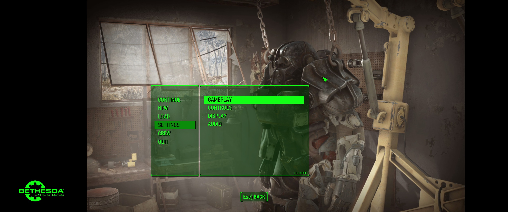
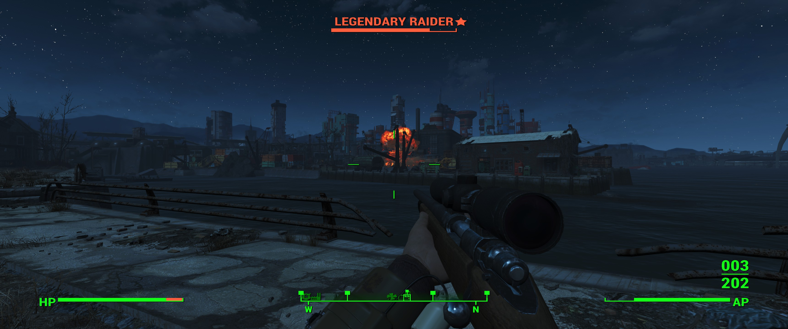
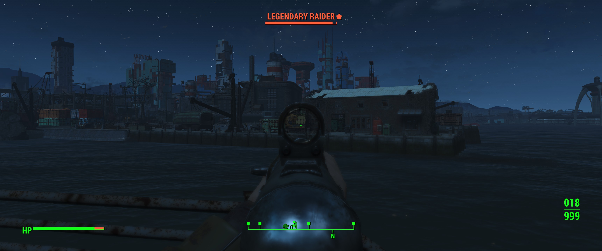
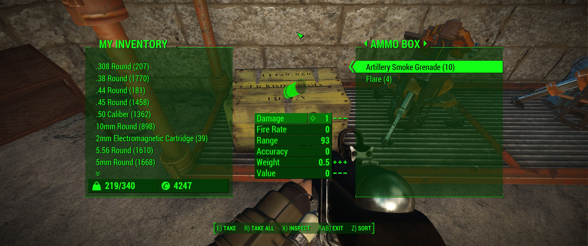

# FO4-Wrench

FO4-Wrench is a configurable mod for Fallout 4, containing fixes and behavior
modifications.

* Adds options for modifying stretching behavior of each individual UI element.
  This allows UI modders to create a single version of their mod that will work
  with all aspect ratios. In addition, it fixes many of the stock UI elements.
* Fixes the placement and scaling of UI backdrops in non-standard aspect ratios,
  so they no longer appear misplaced.

It is implemented as a wrapper around XInput since the game voluntarily loads
the XInput dll, and the XInput API is tiny enough that wrapping it is just about
effortless. Simply drop the dll in the game folder to get started.

[Screenshots](#screenshots)

## Building

MSVC is the only supported compiler, and Visual Studio 2015 *may* be required as
I've made no effort to support older versions. Compiling should just be a matter
of opening the solution and building. All the dependencies are embedded in the
project.

## Configuration

FO4-Wrench is configured through a [TOML](/toml-lang/toml) file named
**Wrench.toml** inside your **Documents\My Games\Fallout4** configuration
folder. If that folder does not exist, either create it or simply launch the
game as that will create it for you. All configuration options are optional.

* **XInput.Path**
  > The path to the *real* XInput1_3.dll.

* **Movies.`filename`.ScaleMode**:
  > The scale mode to use for the UI element with the given `filename`. The path
    should use forward slashes, not backslashes. Possible options are:

    * `"NoScale"`: No scaling, the UI element's native size will be used.
    * `"ShowAll"`: Resize the UI element to fill the viewport, while maintaining
      the aspect ratio. The viewport is not clipped however, so individual UI
      elements may still use the full size. The default HUD for example uses the
      entire viewport area, while the default fader clip does not.
    * `"ExactFit"`: Resize the UI element, disregarding the aspect ratio. If the
      clip's aspect ratio is not the same as that of the viewport, it will be
      stretched to cover the viewport.
    * `"NoBorder"`: Resize the UI element to fill the viewport, while
      maintaining the aspect ratio. Contents may be clipped.

### Default configuration

```toml
[XInput]
Path = '%WINDIR%\system32\XInput1_3.dll'

[Movies."Interface/HUDMenu.swf"]
ScaleMode = "ShowAll"

[Movies."Interface/ButtonBarMenu.swf"]
ScaleMode = "ShowAll"
```

## Libraries

* [cpptoml](/skystrife/cpptoml)
* [udis86](/vmt/udis86)

## Screenshots


Default main menu in 21:9.


Default main menu in 21:9, with this mod in its default configuration.


Default HUD in 21:9.


Default HUD in 21:9, with this mod in its default configuration.


Default container UI in 21:9.


Default container UI in 21:9, with this mod in its default configuration.
