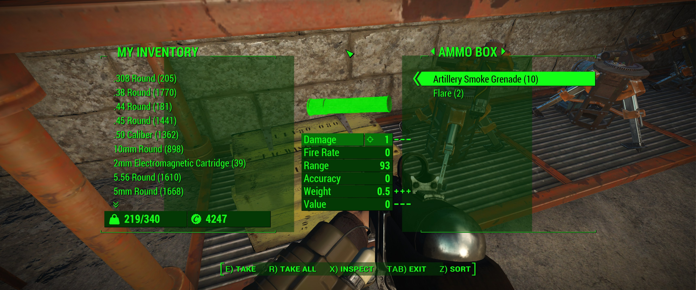

# FO4-Wrench

FO4-Wrench is a configurable mod for Fallout 4, containing fixes and behavior
modifications.

* Adds options for modifying scaling behavior of each individual UI clip.
  This fixes scaling for most of the default UI elements in non-16:9 aspect
  ratios, and allows UI modders to create a single version of their mods that
  will work with all aspect ratios.
* Fixes the placement and scaling of UI backdrops in non-standard aspect ratios,
  so they no longer appear misplaced.

It is implemented as a wrapper around XInput since the game voluntarily loads
the XInput dll, and the XInput API is tiny enough that wrapping it is just about
effortless. Simply drop the dll in the game folder to get started. See the
[configuration section](#configuration) for fine-tuning.

Note that since this mod only changes native behavior and no assets, it should
be compatible with any mods that don't modify the game in the same way.

[Screenshots](#screenshots)

## Building

MSVC is the only supported compiler, and Visual Studio 2015 is likely required
as I've made no effort to support older versions. You will need a version of the
Windows SDK that comes with DX11 headers (it should have been included in the
Visual Studio install). Compiling should just be a matter of opening the
solution and building. All the remaining dependencies are embedded in the
project.

## Configuration

FO4-Wrench is configured through a [TOML](/toml-lang/toml) file named
**Wrench.toml** inside your **Documents\My Games\Fallout4** folder. If that
folder does not exist, either create it or simply launch the game as that will
create it for you. All configuration options are optional.

* **XInput.Path**
  > The path to the *real* XInput1_3.dll.

* **Features.`feature`**
  > Boolean enabling or disabling individual mod features.

    * `BackdropFix`: Enables or disables the backdrop aspect ratio fix.
    * `UiScale`: Enables or disables UI clip scaling.

* **UiScale.`filename`**:
  > The scale mode to use for the UI clip with the given `filename`. The path
    should use forward slashes, not backslashes. Requires UI clip scaling to
    be enabled. You may inspect the **Wrench.log** file next to the
    configuration file for the possible file names, and their current scale
    mode. Please note that file names are case sensitive.

  > Possible options are:

  > * `"NoScale"`: No scaling, the UI clip's native size will be used.
  > * `"ShowAll"`: Resize the UI clip to fill the viewport, while maintaining
      aspect ratio. No clipping is applied, so UI clips may use the full
      viewport size.
  > * `"ExactFit"`: Resize the UI clip, disregarding the aspect ratio. If the
      clip's aspect ratio is not the same as that of the viewport, it will be
      stretched to cover the viewport.
 > * `"NoBorder"`: Resize the UI clip to fill the viewport, while
      maintaining aspect ratio. Contents outside the normal aspect ratio may be
      clipped.

### Default configuration

Note that the below values are used by default even when not specified. You only
need to specify them in the config file if you want to override them.

Please note that the default UiScale settings have only been tested in a 21:9
aspect ratio. They should still work fine with other aspect ratios, but should
you encounter issues, please create an issue.

```toml
[XInput]
Path = '%WINDIR%\system32\XInput1_3.dll'

[Features]
BackdropFix = true
UiScale = true

[UiScale]
"Interface/ButtonBarMenu.swf" = "ShowAll"           # Key labels at the bottom of menus
"Interface/ExamineMenu.swf" = "ShowAll"             # Crafting menu
"Interface/HUDMenu.swf" = "ShowAll"                 # Regular HUD
"Interface/PromptMenu.swf" = "ShowAll"              # Confirmation prompt
"Interface/Workshop.swf" = "ShowAll"                # Workshop menu
"Interface/Workshop_CaravanMenu.swf" = "ShowAll"    # Sending companions to outposts
```

## Libraries

* [cpptoml](https://github.com/skystrife/cpptoml)
* [udis86](https://github.com/vmt/udis86)

## Screenshots


Default main menu in 21:9.


Default main menu in 21:9, with this mod in the recommended configuration.


Default HUD in 21:9.


Default HUD in 21:9, with this mod in the recommended configuration.


Default container UI in 21:9.


Default container UI in 21:9, with this mod in the recommended configuration.
